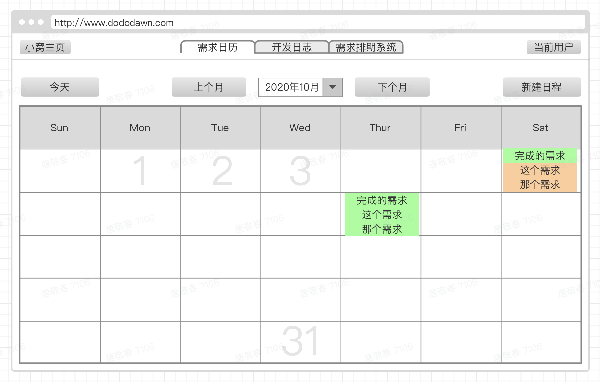
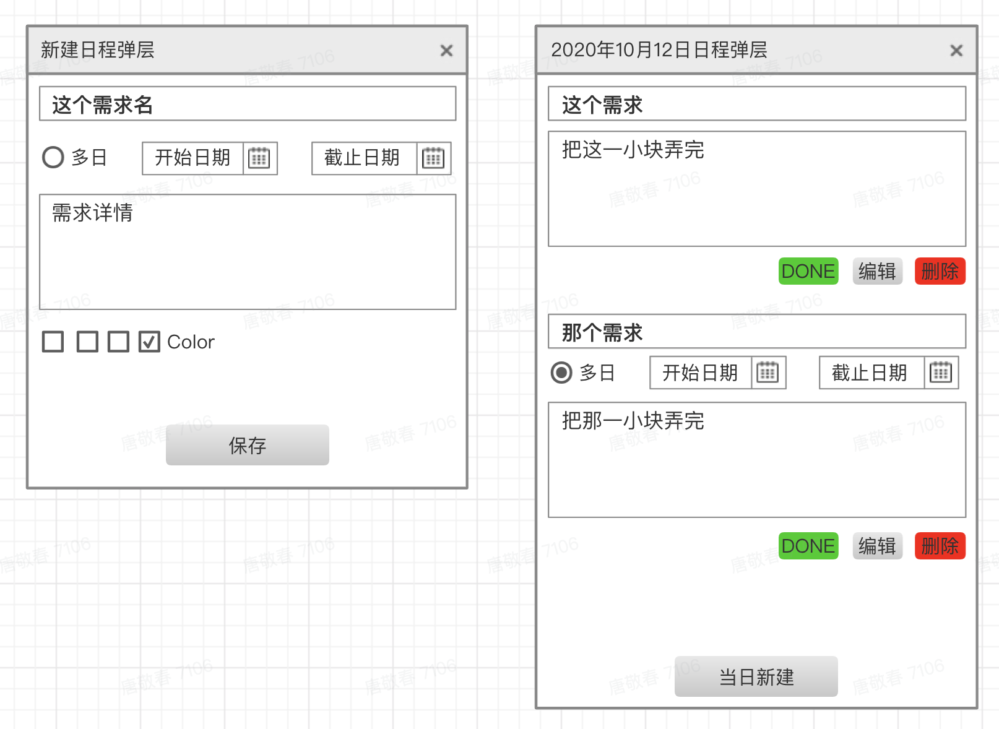
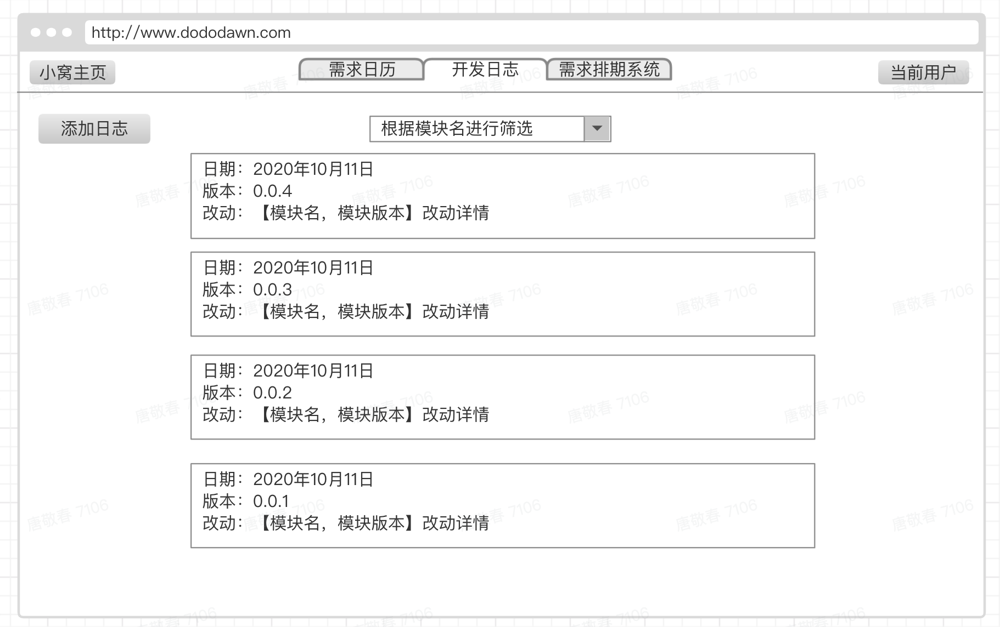
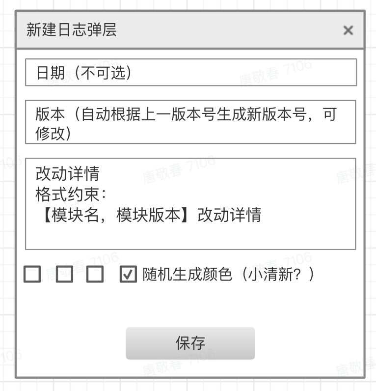
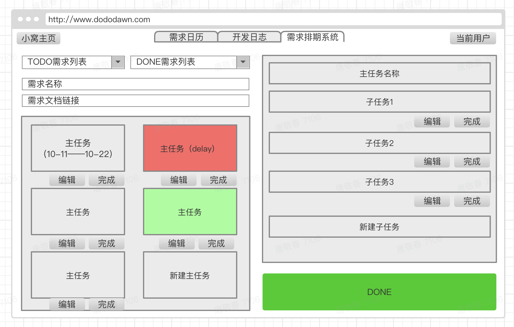
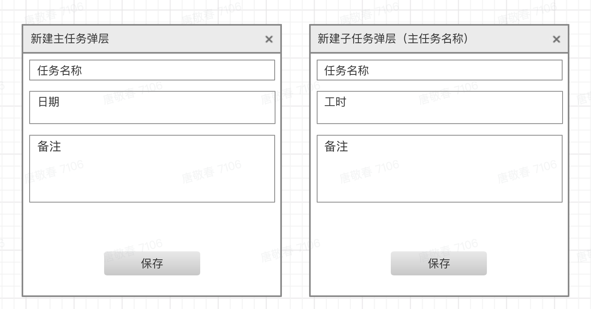

# 需求日历、开发日志、排期系统 产品文档

需求汇总：[小破站需求汇总文档](./00-小破站需求汇总.md)
> 时间：2020年10月11日  
> 背景：小破站的开发止步不前，效率低下，需要一个强有力的执行系统督促糖娃子奋发图强  
> 工时预估：10d

### UI 原型图
#### 需求日历
|模块|UI|描述|
|:--:|--|--|
|主页||如图,点击今天，要求跳转到今日的日期栏并闪烁边框。 点击切换，切换日历。 点击具体日期栏，展示下图二。 点击新建日程，展示下图一(过去的日期不可新建日程)|
|日程新建 以及展示||如图，点击Done，颜色变为绿色（设置时没有绿色，完成态专属） 展示分为单日卡片和多日卡片，样式些许不同。 点击编辑都弹出图一 点击当日新建，弹出图一，且多日选项不可用|

#### 开发日志
|模块|UI|描述|
|:--:|--|--|
|主页||如图,点击新建，展示下图弹窗，新建按钮对外人不可见|
|日志新建||如图，日期自动生成 版本可手动更新|

#### 需求排期系统
|模块|UI|描述|
|:--:|--|--|
|主页||如图...操作按钮对外人不可见|
|日程新建 以及展示||如图...|

### 工时预估
|模块|工时|备注|
|:--:|:--:|--|
|需求日历|4d||
|开发日志|2d||
|排期系统|4d||
|合计|10d||